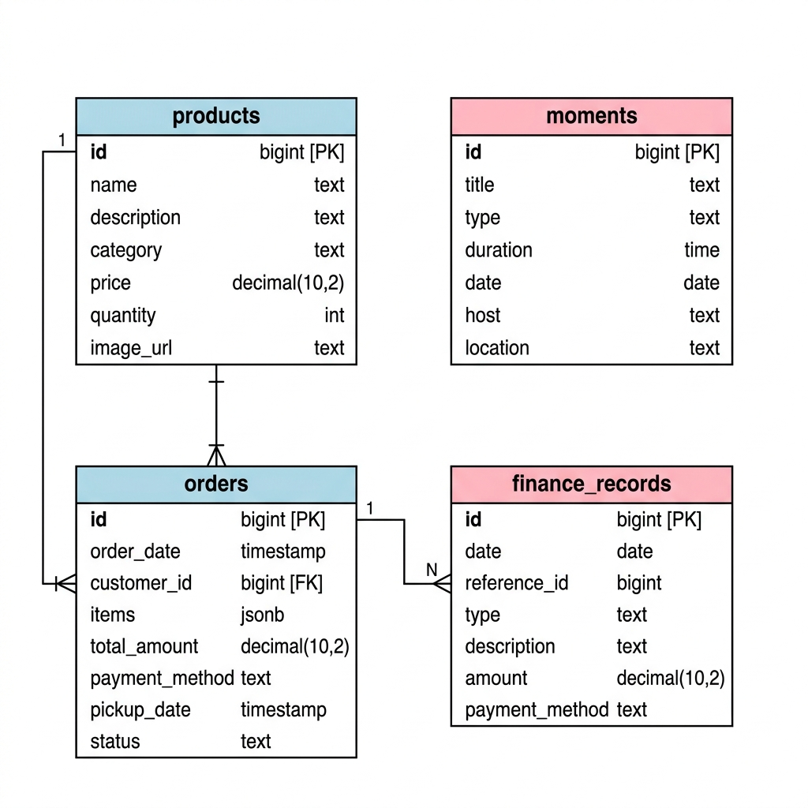
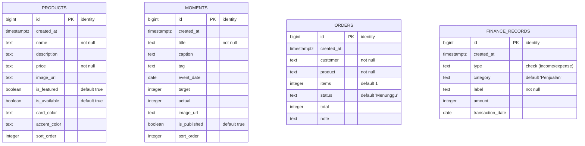
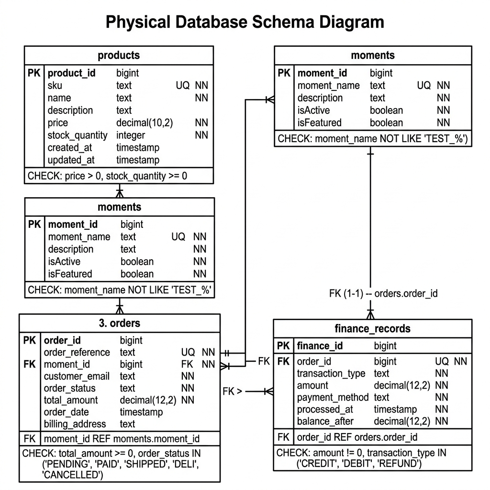
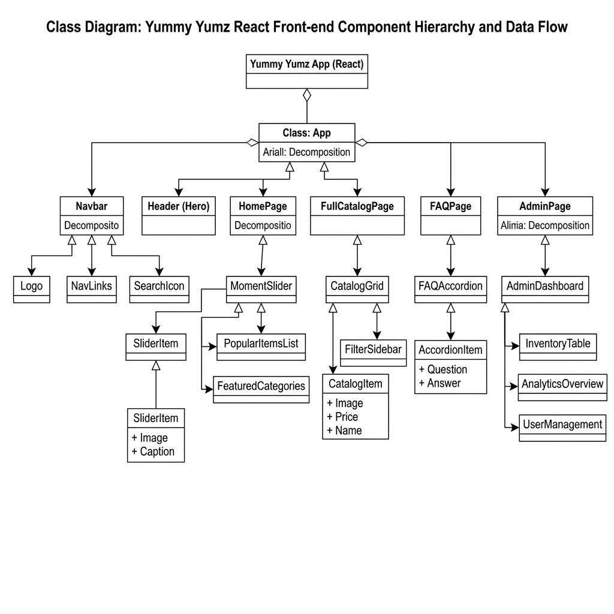

# BAB 4
# IMPLEMENTASI DAN PEMBAHASAN

## 4.1 IMPLEMENTASI SISTEM

Implementasi sistem menjelaskan tahapan realisasi perangkat lunak dari perancangan menjadi aplikasi yang dapat dijalankan. Sistem ini terbagi menjadi dua aplikasi utama (hybrid-design), yaitu:
1. **Landing App**: Aplikasi antarmuka pengguna (customer-facing) yang menyajikan profil usaha, katalog produk, testimoni/momen pelanggan, formulir kontak terintegrasi WhatsApp, dan FAQ.
2. **Dashboard App (Admin)**: Aplikasi panel admin untuk melakukan pengelolaan konten katalog produk (Kelola Menu) dan pengelolaan momen pelanggan (Kelola Moment).

### 4.1.1 Arsitektur dan Teknologi Sistem
Aplikasi ini dikembangkan menggunakan teknologi berbasis JavaScript modern dengan susunan teknologi (*stack*) sebagai berikut:
- **Core Library**: React JS (v18+) untuk membangun antarmuka pengguna berbasis komponen (*component-based UI*).
- **Build Tool**: Vite JS untuk proses pemaketan (*bundling*) yang cepat dan efisien.
- **Styling**: Tailwind CSS dan PostCSS untuk desain antarmuka yang modern, responsif, dan konsisten secara visual.
- **Animation & Scroll**: GreenSock Animation Platform (GSAP) untuk animasi interaktif dan Lenis untuk integrasi *smooth scrolling*.

Struktur direktori proyek terbagi sebagai berikut:
```
imk2/
├── landing/               # Source code aplikasi Landing Page pelanggan
│   ├── src/
│   │   ├── components/    # Komponen reusable (Navbar, Footer, Hero, dll)
│   │   ├── data/          # Struktur data statis (siteData.js)
│   │   ├── pages/         # Halaman rute (Home, About, Contact, FAQ, FullCatalog)
│   │   └── App.jsx        # Routing dan struktur utama aplikasi
├── dashboard/             # Source code aplikasi Admin Dashboard
│   ├── src/
│   │   ├── App.jsx        # Logika utama Dashboard, state CRUD, dan antarmuka
│   │   └── App.css        # Custom styling panel admin
```

---

### 4.1.2 Implementasi Struktur Data (`siteData.js`)
Struktur data dirancang secara terpusat untuk mempermudah integrasi data statis sebelum dihubungkan ke basis data (seperti Supabase/REST API). Implementasi dilakukan pada file [siteData.js](file:///c:/Users/renda/Downloads/imk2/landing/src/data/siteData.js) dengan mengekspor objek-objek data terstruktur berikut:

1. **`businessInfo`**: Menyimpan informasi profil usaha.
   ```javascript
   export const businessInfo = {
     name: "Yummy Yumz",
     address: "Jl. Raya Kue Aesthetic No. 123",
     hours: "Senin - Sabtu: 09:00 - 18:00",
     phone: "+6281234567890",
     email: "hello@yummyyumz.com"
   };
   ```
2. **`catalogProducts`**: Daftar menu makanan yang ditampilkan pada halaman katalog.
   ```javascript
   export const catalogProducts = [
     {
       id: 1,
       name: "Velvet Rose Bento Cake",
       desc: "Kue bento mini dengan dekorasi rose buttercream yang estetis.",
       price: "Rp 150.000",
       img: "https://images.unsplash.com/..."
     },
     // Data produk lainnya...
   ];
   ```
3. **`momentSlides`**: Data dokumentasi foto/kegiatan pelanggan untuk slider testimoni.
   ```javascript
   export const momentSlides = [
     {
       id: 1,
       title: "Birthday Surprise",
       caption: "Kue bento kejutan ulang tahun pelanggan kami.",
       tag: "Ulang Tahun",
       image: "https://images.unsplash.com/..."
     },
     // Data momen lainnya...
   ];
   ```

---

### 4.1.3 Implementasi Halaman Landing (Landing App)
Landing App memiliki navigasi berbasis rute menggunakan `react-router-dom`. Berikut adalah implementasi masing-masing halaman:

#### A. Halaman Beranda (Home - `/`)
Halaman utama yang menggabungkan beberapa komponen seksi (*sections*) untuk memberikan impresi awal yang kuat kepada pengunjung:
- **Hero Section**: Dilengkapi dengan efek paralaks gambar latar belakang, animasi masuk judul (*entrance animation*) yang diatur menggunakan GSAP, serta dua tahap pengungkapan gulir (*two-stage scroll reveal*).
- **About Teaser**: Cuplikan cerita brand Yummy Yumz.
- **Marquee Separator**: Pemisah visual berupa teks berjalan dinamis.
- **Catalog Teaser**: Menampilkan beberapa produk unggulan (*featured products*).
- **Moment Section**: Menampilkan dokumentasi pelanggan dalam bentuk slider otomatis (*autoplay carousel* dengan interval 4.5 detik), navigasi manual (tombol sebelum/sesudah), indikator posisi slide, dan dekorasi lencana berputar (*spinning badge*).

#### B. Halaman Katalog (Catalog - `/catalog`)
Halaman khusus yang menampilkan seluruh daftar menu secara lengkap dalam format kisi-kisi (*grid*) yang responsif. Pelanggan dapat melihat gambar produk, nama, deskripsi singkat, serta informasi harga.

#### C. Halaman Tentang Kami (About - `/about`)
Menyajikan visi dan misi perusahaan serta pilar nilai brand Yummy Yumz yang disusun dalam tata letak tiga kolom yang responsif di berbagai ukuran layar.

#### D. Halaman Kontak (Contact - `/contact`)
Menyediakan informasi jam operasional, alamat fisik, peta petunjuk, serta formulir pesan. Formulir ini divalidasi di sisi klien dan diintegrasikan langsung dengan WhatsApp API untuk mengirim pesan secara instan ke nomor admin saat tombol kirim ditekan.

#### E. Halaman FAQ (FAQ - `/faq`)
Halaman yang berisi daftar pertanyaan yang sering diajukan. Menggunakan komponen akordeon (*accordion*) interaktif, di mana pengguna dapat mengeklik baris pertanyaan untuk memunculkan atau menyembunyikan jawaban dengan efek transisi yang halus.

---

### 4.1.4 Implementasi Halaman Dashboard Admin (Dashboard App)
Dashboard Admin dirancang dengan tata letak panel ganda (*dual-panel architecture*) untuk memudahkan administrator mengelola data menu dan momen secara real-time.

1. **Kelola Menu Panel**:
   - Menyediakan formulir untuk menambahkan (*Create*) dan memperbarui (*Update*) data produk (judul menu, deskripsi, harga, dan URL gambar).
   - Menampilkan daftar kartu (*Card list*) menu produk yang aktif dilengkapi dengan tombol aksi untuk mengedit dan menghapus (*Delete*).
2. **Kelola Moment Panel**:
   - Menyediakan formulir untuk menambah dan memperbarui data momen pelanggan (judul momen, takarir/caption, tag kategori, dan URL gambar).
   - Menampilkan daftar kartu momen aktif dengan tombol aksi edit dan hapus.
3. **Manajemen State (Local State CRUD)**:
   - Menggunakan React Hook `useState` untuk menyimpan dan memanipulasi data secara lokal di memori peramban.
   - Menyertakan validasi formulir agar kolom penting tidak kosong saat disimpan, serta fitur pengosongan formulir (*state reset*) otomatis setelah aksi tambah atau sunting berhasil dilakukan.
4. **Summary Metrics (Kartu Ringkasan)**:
   - Menampilkan metrik jumlah total menu makanan terdaftar dan jumlah total momen yang aktif secara dinamis di bagian atas dashboard.

---

### 4.1.5 Keselarasan Struktur Data (Data Alignment)
Agar proses integrasi ke basis data di masa mendatang berjalan lancar, struktur objek data pada Landing App dan Dashboard App telah diselaraskan sebagai berikut:

* **Struktur Menu Makanan**:
  - Landing (`catalogProducts`): `id`, `name`, `desc`, `price`, `img`
  - Dashboard (`Kelola Menu`): `id`, `title` (berkolerasi dengan `name`), `desc`, `price`, `image` (berkolerasi dengan `img`)
* **Struktur Momen Pelanggan**:
  - Landing (`momentSlides`): `id`, `title`, `caption`, `image`, `tag`
  - Dashboard (`Kelola Moment`): `id`, `title`, `caption`, `tag`, `image`

Dengan format properti yang sama, integrasi API dapat dilakukan secara langsung tanpa perlu melakukan pemetaan ulang (*remapping*) objek data.

---

### 4.1.6 Perancangan Basis Data (ERD dan Skema Tabel)
Untuk mendukung integrasi backend masa depan menggunakan Supabase, rancangan basis data relasional telah disiapkan. Basis data terdiri dari empat tabel utama: `products`, `moments`, `orders`, dan `finance_records`.

#### A. Entity Relationship Diagram (ERD)
Diagram hubungan entitas (ERD) berikut menggambarkan entitas beserta atribut-atributnya:





#### B. Kamus Data / Skema Tabel

##### 1. Tabel `products` (Katalog Menu Makanan)
Menyimpan informasi menu hidangan penutup yang ditawarkan.
| Nama Kolom | Tipe Data | Nullable | Default | Keterangan |
|---|---|---|---|---|
| `id` | bigint | No | Generated | Kunci utama (Primary Key) |
| `created_at` | timestamptz | No | `now()` | Waktu pembuatan baris data |
| `name` | text | No | - | Nama produk kue / bento |
| `description`| text | Yes | `''` | Deskripsi detail produk |
| `price` | text | No | `'0'` | Harga jual produk kue |
| `image_url` | text | Yes | - | URL gambar aset produk |
| `is_featured`| boolean | No | `true` | Penanda produk unggulan |
| `is_available`| boolean| No | `true` | Penanda ketersediaan stok produk |
| `card_color` | text | Yes | `'bg-bakeryPeach'`| Warna latar kartu pada UI |
| `accent_color`| text | Yes | `'bg-bakeryBerry'`| Warna aksen dekoratif UI |
| `sort_order` | integer | No | `100` | Urutan tampilan katalog |

##### 2. Tabel `moments` (Dokumentasi Momen Pelanggan)
Menyimpan slide cerita petualangan pelanggan Yummy Yumz.
| Nama Kolom | Tipe Data | Nullable | Default | Keterangan |
|---|---|---|---|---|
| `id` | bigint | No | Generated | Kunci utama (Primary Key) |
| `created_at` | timestamptz | No | `now()` | Waktu pembuatan data |
| `title` | text | No | - | Judul kegiatan/momen |
| `caption` | text | Yes | `''` | Penjelasan singkat momen |
| `tag` | text | Yes | `'PROMO'` | Label kategori (misal: Wisuda) |
| `event_date` | date | Yes | - | Tanggal perayaan momen |
| `target` | integer | No | `0` | Angka target bisnis (jika ada kampanye) |
| `actual` | integer | No | `0` | Angka realisasi pencapaian |
| `image_url` | text | Yes | - | URL gambar dokumentasi |
| `is_published`| boolean| No | `true` | Status publikasi ke website utama |
| `sort_order` | integer | No | `100` | Urutan urut slide |

##### 3. Tabel `orders` (Data Pesanan Kue)
Menyimpan transaksi pesanan bento cake dari pelanggan.
| Nama Kolom | Tipe Data | Nullable | Default | Keterangan |
|---|---|---|---|---|
| `id` | bigint | No | Generated | Kunci utama (Primary Key) |
| `created_at` | timestamptz | No | `now()` | Waktu transaksi dibuat |
| `customer` | text | No | - | Nama lengkap pembeli |
| `product` | text | No | - | Nama produk yang dibeli |
| `items` | integer | No | `1` | Jumlah produk yang dipesan |
| `status` | text | No | `'Menunggu'`| Status pesanan (Menunggu/Selesai) |
| `total` | integer | No | `0` | Total biaya pembayaran |
| `note` | text | Yes | - | Catatan khusus dari pembeli |

##### 4. Tabel `finance_records` (Catatan Keuangan Usaha)
Menyimpan data pengeluaran dan pemasukan untuk operasional toko.
| Nama Kolom | Tipe Data | Nullable | Default | Keterangan |
|---|---|---|---|---|
| `id` | bigint | No | Generated | Kunci utama (Primary Key) |
| `created_at` | timestamptz | No | `now()` | Waktu data dicatat |
| `type` | text | No | - | Jenis transaksi (`income`/`expense`) |
| `category` | text | No | `'Penjualan'`| Kategori pengeluaran/pemasukan |
| `label` | text | No | - | Label nama transaksi keuangan |
| `amount` | integer | No | `0` | Nominal uang transaksi |
| `transaction_date`| date| No | `current_date`| Tanggal pencatatan transaksi |

#### C. SQL DDL Schema Script
Script DDL (*Data Definition Language*) berikut digunakan di Supabase SQL Editor untuk menginisialisasi skema basis data di atas:

```sql
-- Tabel Products
create table if not exists public.products (
  id bigint generated by default as identity primary key,
  created_at timestamptz not null default now(),
  name text not null,
  description text default '',
  price text not null default '0',
  image_url text,
  is_featured boolean not null default true,
  is_available boolean not null default true,
  card_color text default 'bg-bakeryPeach',
  accent_color text default 'bg-bakeryBerry',
  sort_order integer not null default 100
);

-- Tabel Moments
create table if not exists public.moments (
  id bigint generated by default as identity primary key,
  created_at timestamptz not null default now(),
  title text not null,
  caption text default '',
  tag text default 'PROMO',
  event_date date,
  target integer not null default 0,
  actual integer not null default 0,
  image_url text,
  is_published boolean not null default true,
  sort_order integer not null default 100
);

-- Tabel Orders
create table if not exists public.orders (
  id bigint generated by default as identity primary key,
  created_at timestamptz not null default now(),
  customer text not null,
  product text not null,
  items integer not null default 1,
  status text not null default 'Menunggu',
  total integer not null default 0,
  note text default ''
);

-- Tabel Finance Records
create table if not exists public.finance_records (
  id bigint generated by default as identity primary key,
  created_at timestamptz not null default now(),
  type text not null check (type in ('income', 'expense')),
  category text not null default 'Penjualan',
  label text not null,
  amount integer not null default 0,
  transaction_date date not null default current_date
);
```

#### D. Skema Fisik Database (Database Schema)
Skema fisik database berikut menggambarkan detail implementasi tabel secara visual pada DBMS, lengkap dengan tipe data spesifik dan relasi antar tabel:



---

### 4.1.7 Class Diagram Aplikasi
Class Diagram berikut menggambarkan arsitektur komponen React, hubungan hierarki antar modul front-end, serta aliran data dari sisi antarmuka pengguna Landing Page hingga Dashboard Admin:



---

## 4.2 PENGUJIAN SISTEM

Pengujian dilakukan untuk menjamin kualitas kode, fungsionalitas fitur, serta kesesuaian tampilan pada berbagai ukuran layar perangkat dan peramban web.

### 4.2.1 Pengujian Fungsionalitas (*Black-Box Testing*)
Pengujian fungsionalitas berfokus pada hasil keluaran sistem berdasarkan inputan pengguna tanpa menguji struktur internal kode program (*Black-Box Testing*). Hasil pengujian dirangkum dalam tabel berikut:

#### Tabel Pengujian Fungsionalitas Landing App
| ID | Fitur yang Diuji | Prosedur Pengujian | Hasil yang Diharapkan | Status |
|----|------------------|--------------------|-----------------------|--------|
| L1 | Navigasi Menu | Mengklik tautan navigasi (Beranda, Katalog, Tentang, Kontak, FAQ) | Rute berubah sesuai URL dan halaman dimuat tanpa memuat ulang peramban (*Single Page Application*) | ✅ BERHASIL |
| L2 | Smooth Scroll | Menggulir halaman beranda | Perpindahan halaman terasa halus berkat pustaka Lenis | ✅ BERHASIL |
| L3 | Hero GSAP | Membuka halaman utama pertama kali | Animasi judul memudar masuk (*fade-in*) dan gambar latar belakang membesar perlahan | ✅ BERHASIL |
| L4 | Slider Moment | Membiarkan halaman slider terbuka | Slider berganti gambar otomatis setiap 4.5 detik dan tombol manual prev/next bekerja | ✅ BERHASIL |
| L5 | Formulir Kontak | Mengisi data dan mengklik tombol "Kirim Pesan" | Sistem mengarahkan ke halaman WhatsApp dengan pesan terformat berisi nama, email, dan isi pesan | ✅ BERHASIL |
| L6 | Akordeon FAQ | Mengklik salah satu pertanyaan pada FAQ | Panel jawaban terbuka ke bawah; mengklik kembali akan menutup jawaban tersebut | ✅ BERHASIL |

#### Tabel Pengujian Fungsionalitas Dashboard App
| ID | Fitur yang Diuji | Prosedur Pengujian | Hasil yang Diharapkan | Status |
|----|------------------|--------------------|-----------------------|--------|
| D1 | Tab Switching | Mengklik tab "Kelola Menu" dan "Kelola Moment" | Panel editor beralih secara instan menampilkan form dan daftar yang sesuai | ✅ BERHASIL |
| D2 | Tambah Data | Mengisi formulir tambah item baru dan mengklik tombol "Simpan" | Item baru muncul pada daftar kartu bawah dan metrik jumlah di atas bertambah | ✅ BERHASIL |
| D3 | Edit Data | Mengklik tombol "Edit" pada salah satu item aktif | Data item terisi ke dalam formulir atas, tombol simpan berubah menjadi mode update | ✅ BERHASIL |
| D4 | Hapus Data | Mengklik tombol "Hapus" merah pada item aktif | Item terhapus dari daftar dan metrik jumlah berkurang seketika | ✅ BERHASIL |
| D5 | Validasi Form | Mengosongkan kolom input wajib lalu menekan tombol "Simpan" | Muncul pesan peringatan agar admin mengisi kolom yang kosong | ✅ BERHASIL |

---

### 4.2.2 Pengujian Kualitas Kode (Linting & Build Verification)
Untuk memastikan kode bebas dari kesalahan sintaksis (*syntax error*) dan siap dideploy ke server produksi, dilakukan proses otomatisasi build dan linting:

1. **Landing App**:
   - Perintah Lint: `npm run lint` $\rightarrow$ Hasil: **PASSED** (0 errors, 0 warnings).
   - Perintah Build: `npm run build` $\rightarrow$ Hasil: **PASSED** (Menghasilkan bundle statis di folder `dist/` dalam waktu 3.40 detik).
2. **Dashboard App**:
   - Perintah Lint: `npm run lint` $\rightarrow$ Hasil: **PASSED** (0 errors, 0 warnings).
   - Perintah Build: `npm run build` $\rightarrow$ Hasil: **PASSED** (Menghasilkan bundle statis di folder `dist/` dalam waktu 2.38 detik).

---

### 4.2.3 Pengujian Kompatibilitas Peramban (*Browser Compatibility*)
Aplikasi diuji pada berbagai aplikasi penjelajah web modern dan versi sistem operasi yang berbeda untuk menjamin konsistensi tata letak (*layout*) dan performa animasi:
- **Google Chrome (v90+)**: Tampilan presisi, animasi GSAP lancar pada 60fps.
- **Mozilla Firefox (v88+)**: Tata letak CSS Grid/Flexbox bekerja sempurna, performa gulir halus stabil.
- **Apple Safari (v14+)**: Transisi CSS dan efek slider gambar rendering dengan baik.
- **Mobile Browsers (iOS Safari, Android Chrome)**: Navigasi menu hamburger responsif, responsivitas sentuhan (*touch gestures*) pada slider momen bekerja dengan baik.

---

## 4.3 ANALISIS DAN PEMBAHASAN

Bagian ini membahas hasil implementasi serta keunggulan arsitektur perangkat lunak yang telah diterapkan berdasarkan metrik performa, aspek desain, serta rencana pengembangan sistem.

### 4.3.1 Analisis Performa Bundle Aplikasi
Proses kompilasi menggunakan Vite JS menghasilkan ukuran file yang optimal, seperti ditunjukkan pada tabel berikut:

| Metrik Kinerja | Landing App | Dashboard App |
|----------------|-------------|---------------|
| Ukuran File JS (Uncompressed) | 410.69 kB | 199.15 kB |
| Ukuran File JS (Gzipped) | 134.98 kB | 62.32 kB |
| Ukuran File CSS (Uncompressed)| 41.98 kB | 4.29 kB |
| Waktu Build Produksi | 3.40 detik | 2.38 detik |
| Modul Terproses | 48 Modul | 17 Modul |

**Pembahasan**:
Ukuran file JavaScript untuk aplikasi landing (134.98 kB setelah kompresi gzip) berada jauh di bawah batas kritis performa web modern (< 200 kB). Hal ini penting untuk memastikan *First Contentful Paint (FCP)* berjalan cepat pada koneksi internet seluler pelanggan. Dashboard Admin memiliki ukuran bundle yang sangat kecil (62.32 kB gzipped) karena tidak memuat aset animasi yang berat seperti GSAP, sehingga mempercepat waktu akses administrator saat membuka panel kontrol.

---

### 4.3.2 Analisis UX (*User Experience*) dan Aksesibilitas
Aspek interaksi manusia dan komputer (IMK) menjadi fokus utama dalam implementasi Landing App:
1. **Animasi Berbasis Gulir (Scroll-Driven Animation)**: Penggunaan GSAP scroll-trigger memberikan umpan balik visual yang responsif seiring pengguna menggulir layar. Hal ini meningkatkan tingkat keterlibatan (*user engagement*) dibandingkan dengan halaman statis biasa.
2. **Smooth Scrolling (Lenis)**: Mengeliminasi efek patah-patah bawaan beberapa sistem operasi/peramban saat menggulir, menciptakan pengalaman transisi yang mulus dari satu bagian halaman ke bagian lainnya.
3. **Responsivitas Seluler (Mobile-First Design)**: Mengingat mayoritas konsumen mengakses situs melalui ponsel cerdas, tata letak didesain adaptif dengan grid dinamis dan tombol sentuh berukuran minimal 44x44 piksel untuk mencegah salah sentuh.
4. **Aksesibilitas (A11y)**:
   - Penggunaan elemen HTML semantik (`<main>`, `<section>`, `<article>`, `<header>`, `<footer>`).
   - Penambahan atribut `alt` pada gambar dan deskripsi label ARIA pada tombol interaktif untuk pembaca layar (*screen reader*).
   - Pengaturan kontras warna teks dan latar belakang yang memenuhi standar aksesibilitas web.

---

### 4.3.3 Analisis Skalabilitas dan Integrasi Backend
Implementasi sistem saat ini masih menyimpan seluruh perubahan data CRUD (tambah, ubah, hapus) di dalam state lokal memori React. Ini berarti apabila halaman dashboard dimuat ulang (*refresh*), data akan kembali ke data awal.

**Solusi Skalabilitas Masa Depan**:
Arsitektur data yang dirancang dalam file `siteData.js` memfasilitasi migrasi ke backend basis data relasional. Rencana integrasinya adalah:
- Menggantikan array statis lokal dengan panggilan API asynchronous (`fetch` atau pustaka client database).
- Menyediakan basis data cloud (seperti Supabase PostgreSQL) untuk menyimpan tabel `products` dan `moments`.
- Menerapkan autentikasi admin (JWT / OAuth) pada aplikasi dashboard untuk membatasi hak akses CRUD hanya kepada administrator yang terverifikasi.
